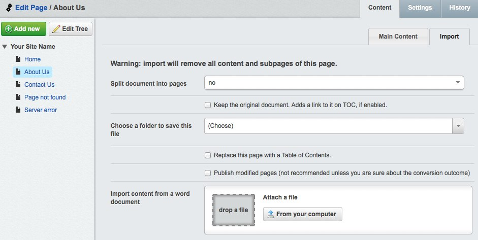

This page documents how to use the Document Converter module.

## Usage

Whether the document converter options will appear on your website it depends on how it has been set up. For this manual we will assume the conversion has been allowed globally.

First of all it is important to know that the import process will replace the content of the page your are importing to, and it also has a licence to remove and replace all its children. It will still be possible to get the content back from the version history of the CMS, but it's good to keep that in mind.

### Interface

If you upload the document straight away the simplest scenario will be executed:
 * The content of the main page will be replaced by the imported markup
 * The original document will be removed afterwards
 * The page will remain in draft mode for you to preview the output
 * All images that came with the document will be stored in the top level directory of the assets

The interface will allow you to fine tune your import options. Import will start as soon as you choose the file to import, so set up the options beforehand. The options are, from top to bottom:

* *Split document into pages*: scans the document looking for level 1 or level 2 headings and
  puts each subsection into separate child page. It will cause the conversion process to
  replace the existing children pages completely. The initial part of the document until the 
  first header occurence will be added to the main page instead.
* *Keep the original document*: prevents the removal of the uploaded document. The document will become
  available in the `Files` section of the CMS. Also, if the TOC has been enabled, the link will be
  automatically added to the main page.
* *Choose a folder to save this file*: asset directory to be used for storing the original document and the
  image files that came along with the document.
* *Replace this page with a Table of Contents*: will generate the Table of Contents and replace the main page 
  content with it. Caution: this can remove some of the document content that would otherwise be added here
  (see the *Split document into pages* option above).
* *Publish modified pages*: in addition to performing all other actions it will publish the pages. Reviewing
  the conversion outcome is advised before publishing, so avoid this option unless you are sure what will 
  be produced.

